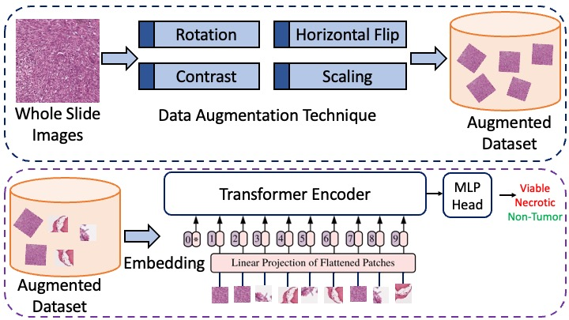

# OsteoNet: Vision Transformer for Automated Grading of Whole Slide Histological Images of Osteosarcoma


## Notes:
* This is an implementation project as a part of IS 755 Advanced Artificial Intelligence FA2023.
* Dataset is available in : https://wiki.cancerimagingarchive.net/pages/viewpage.action?pageId=52756935

## Dataset Citation:
```
@article{Arunachalam2019ViableAN,
  title={Viable and necrotic tumor assessment from whole slide images of osteosarcoma using machine-learning and deep-learning models},
  author={Harish Babu Arunachalam and Rashika Mishra and Ovidiu Daescu and Kevin Cederberg and Dinesh Rakheja and Anita Sengupta and David Leonard and Rami R. Hallac and Patrick J. Leavey},
  journal={PLoS ONE},
  year={2019},
  volume={14}
}
```


## Acknowledgement:
* Base ViT code is borrowed from official implementation borrowed from repo : https://github.com/google-research/vision_transformer


